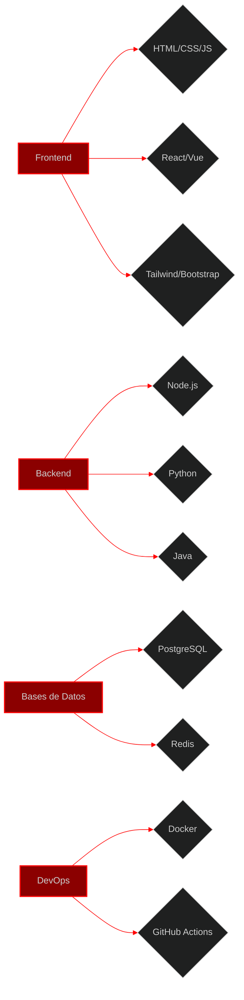

# 🔥 LUIS ALFONSO GARCÍA LAGO 🔥
## FULL-STACK DEMON ENGINEER 

<p align="center">
  
</p>

<p align="center">
  
</p>

---

<details open>
<summary><h2> MANIFIESTO</h2></summary>

```javascript
const luisAlfonso107 = {
  estado: "Activo",
  naturaleza: "Curiosidad insaciable",
  proposito: "Incompleto",
};
```
</details>

<details open>
<summary><h2> PERFIL PROFESIONAL</h2></summary>
<div align="center"> 
  <table> <tr> <td align="center" width="200">  </td> <td> <h3>⚡ LUIS ALFONSO GARCÍA LAGO ⚡</h3> <p><strong>ID:</strong> OneOseven107 • <strong>Rango:</strong>Full-Stack • <strong>Alma:</strong>  Comprometida</p> <p><i>full-stack  • Backend • Código corrupto desde 23/1/06 • JSON</i></p> <p> <strong>Estado actual:</strong> En línea</p> </td> </tr> </table> 
</div>
</details>

<details>
<summary><h2>ESPECIALIZACIONES </h2></summary>

- 😈 **Frontend:** React, Vue, Tailwind 
- 💀 **Backend:** Node.js, Python, Java 
- 🩸 **Bases de Datos:** PostgreSQL, Redis, MongoDB 
- 🔧 **DevOps:** Docker, GitHub Actions 
- 🧪 **Testing Sacrificial:** Jest, Cypress (los tests nunca mueren, solo se transforman)

</details>

## 🔥 TECNOLOGÍAS 

<div align="center">
<h3>🩸 STACK PRINCIPAL</h3>


<br/>

<h3>⚡ STACK VISUAL</h3>


</div>

<details>
<summary><h3>🕸️ ARQUITECTURA DE DOMINIO</h3></summary>


</details>

## 📊 ESTADÍSTICAS

<div align="center"> 
  <table> <tr> <td> <h3>🔥 MÉTRICAS 🔥</h3> <ul> <li><strong>Commits realizados:</strong> Innumerables</li> <li><strong>Pull Requests aceptados:</strong> 99.9%</li> <li><strong>Bugs:</strong> ∞ + 666</li> <li><strong>Tazas de café:</strong> 666L</li> <li><strong></strong> 107</li> </ul> </td> <td>  </td> </tr> <tr> <td colspan="2" align="center">  </td> </tr> </table> 
</div>

## 🎨 CONTRIBUCIONES

<p align="center"> 
  <picture> 
    <source media="(prefers-color-scheme: dark)" srcset="https://raw.githubusercontent.com/LuisAlfonso107/LuisAlfonso107/output/pacman-contribution-graph-dark.svg"> 
     
  </picture> 
  <br> 
  <i>⬆️ Pacman ⬆️</i> 
</p>

<details>
<summary><h2>💻 FRAGMENTOS DE CÓDIGO</h2></summary>

### 🔮 Invocación de Demonios (Javascript)
```javascript
// API que invoca demonios (y datos)
const invocarDemonio = async (nombre) => {
  try {
    const respuesta = await fetch(`/api/infierno/${nombre}`);
    const demonio = await respuesta.json();
    return demonio;
  } catch (error) {
    console.error("❌ El demonio no respondió (o está ocupado)");
    throw new Error("ERROR 666: Pacto fallido");
  }
};
// Stack: Node.js + Express + PostgreSQL
```

### 🩸 Calculadora Apocalipsis (Python)
```python
class CalculadoraApocalipsis:
    def __init__(self):
        self.almas = 0
        self.pecados = []
    
    def sumar_pecado(self, pecado):
        self.pecados.append(pecado)
        self.almas += 1
        return f"🔥 Pecado '{pecado}' agregado. Almas condenadas: {self.almas}"
    
    def calcular_destruccion(self):
        return f"⚡ Nivel de destrucción: {self.almas * 666}%"
    
    def invocar_apocalipsis(self):
        if self.almas >= 7:
            return "💀 APOCALIPSIS INICIADO - Los 7 pecados capitales han sido cometidos"
        return "😈 Necesitas más pecados..."
```

### 🔥 Dashboard del Abismo (React JSX)
```jsx
function DashboardInfernal() {
  const [almasCondenadas, setAlmasCondenadas] = useState(0);
  const [temperaturaInfierno, setTemperaturaInfierno] = useState(666);
  
  return (
    <div className="infierno-container">
      <h1>🔥 PANEL DE CONTROL DEL ABISMO 🔥</h1>
      <p>Almas condenadas hoy: {almasCondenadas}</p>
      <p>Temperatura actual: {temperaturaInfierno}°C</p>
      <button onClick={() => setAlmasCondenadas(almasCondenadas + 1)}>
        CONDENAR ALMA
      </button>
    </div>
  );
}
```
</details>

## 🕒 ACTIVIDAD RECIENTE EN EL ABISMO

<details open>
<summary><h3>📝 ÚLTIMOS COMMITS</h3></summary>

| Fecha | Commit 
| :---: | :--- |

| 17/03/26 | 🔥 `feat: agregado nuevo círculo al dashboard` |
| 16/03/26 | 💀 `docs: actualizado el grimorio (README)` |

</details>


##  CONTACTO

<p align="center"> 
  <a href="mailto:luisalfonso.garcialago@example.com"> 
     
  </a> 
  <a href="https://discord.com/users/107"> 
     
  </a> 
  <a href="https://www.linkedin.com/in/luis-alfonso-garcia-lago/"> 
     
  </a> 
  <a href="https://github.com/LuisAlfonso107"> 
     
  </a> 
</p>

## VISITANTES 

<div align="center"> 
   
  <br> 
  <i>atrapados al visitar este perfil</i> 
</div>

<details>
<summary><h2>ASCII ART DEMONÍACO</h2></summary>
<pre align="center" style="color:#ff0000; font-family:monospace; font-size:0.9em; line-height: 1.2;"> 
⣿⣿⣿⣿⣿⣿⣿⣿⣿⣿⣿⣿⣿⣿⣿⣿⣿⣿⣿⣿⣿ 
⣿⣿⣿⣿⣿⣿⣿⣿⣿⣿⣿⣿⣿⣿⣿⣿⣿⣿⣿⣿⣿⣿ 
⣿⣿⣿⣿⣿⣿⣿⣿⣿⣿⣿⣿⣿⣿⣿⣿⣿⣿⣿⣿⣿⣿⣿ 
⣿⣿⣿⣿⣿⣿⣿⣿⣿⣿⣿⣿⣿⣿⣿⣿⣿⣿⣿⣿⣿⣿⣿⣿ 
⣿⣿⣿⣿⣿⣿⣿⣿⣿⣿⣿⣿⣿⣿⣿⣿⣿⣿⣿⣿⣿⣿⣿⣿⣿ 
⣿⣿⣿⣿⣿⣿⣿⣿⣿⣿⣿⣿⣿⣿⣿⣿⣿⣿⣿⣿⣿⣿⣿⣿⣿⣿ 
⣿⣿⣿⣿⣿⣿⣿⣿⣿⣿⣿⣿⣿⣿⣿⣿⣿⣿⣿⣿⣿⣿⣿⣿⣿⣿⣿ 
⣿⣿⣿⣿⣿⣿⣿⣿⣿⣿⣿⣿⣿⣿⣿⣿⣿⣿⣿⣿⣿⣿⣿⣿⣿⣿⣿⣿ 
⣿⣿⣿⣿⣿⣿⣿⣿⣿⣿⣿⣿⣿⣿⣿⣿⣿⣿⣿⣿⣿⣿⣿⣿⣿⣿⣿⣿⣿ 
⣿⣿⣿⣿⣿⣿⣿⣿⣿⣿⣿⣿⣿⣿⣿⣿⣿⣿⣿⣿⣿⣿⣿⣿⣿⣿⣿⣿⣿⣿ 
⣿⣿⣿⣿⣿⣿⣿⣿⣿⣿⣿⣿⣿⣿⣿⣿⣿⣿⣿⣿⣿⣿⣿⣿⣿⣿⣿⣿⣿⣿⣿ 
</pre>
</details>

##  PACTO

<p align="center"> 
  <i style="color:#660000;">"Al leer este README, aceptas los términos y condiciones del infierno:</i> 
</p>
<p align="center"> 
  <strong style="color:#ff0000; font-size:1.2em;"> 
    1. Tu alma será procesada en segundo plano<br> 
    2. Los bugs se multiplicarán por 666<br> 
    3. Tus commits sangrarán en producción<br> 
    4. No hay exorcismo que valga<br> 
    5. El abismo te observa... siempre 
  </strong> 
</p>

## 🕯️ ÚLTIMAS PALABRAS

<p align="center"> 
   
</p>
<p align="center"> 
  <strong style="color:#ff0000; font-size:1.5em;">"NO MIRES FIJAMENTE... YA TE VIÓ PRIMERO"</strong> 
</p>
<p align="center"> 
  <i>Última transmisión maldita: 18/03/26 • El pulso del código se debilita... o se fortalece</i> 
</p>
<p align="center"> 
  <sub>⚠️ Este perfil está poseído. Si lees esto, el pacto ya está sellado. No hay vuelta atrás. ⚠️</sub> 
</p>
<p align="center"> 
  <a href="#-luis-alfonso-garcia-lago-"> 
     
  </a> 
</p>
<p align="center"> 
  <sub>107</sub> 
</p>