<div align="center">

# LUIS ALFONSO GARCÍA LAGO

### Arquitecto de Software | Full-Stack Developer

<p align="center">
  
</p>

<p align="center">
  
</p>

_Escribo código que resuelve problemas complejos antes de que se conviertan en incidentes. Sin ruido, sin excusas. Solo lógica pura y ejecución implacable._

---

</div>

## 📂 MANIFIESTO E IDENTIDAD

<details open>
<summary><b>System.getProfile()</b></summary>
<br>

> Soy un desarrollador Full-Stack apasionado por el diseño de sistemas escalables y eficientes. Mi filosofía de trabajo se basa en la disciplina, el análisis crítico y la entrega de soluciones que combinan una estética austera pero premium con un rendimiento excepcional bajo carga extrema.

```yaml
id: "luisalfonso107"
rango: "Full-Stack Developer"
enfoque: 
  - "Sistemas distribuidos"
  - "Rendimiento crítico"
  - "Código inquebrantable"
estado: "Ejecutando rutinas de optimización"
```

</details>

## ⚙️ ARSENAL TÉCNICO

Mi stack está meticulosamente seleccionado para garantizar control absoluto a nivel de bits y despliegues robustos.

<div align="center">

#### FRONTEND


#### BACKEND & DATOS


#### INFRAESTRUCTURA


</div>

## 🕸️ ARQUITECTURA VISUAL

Todo sistema eficiente requiere un flujo determinista en la sombra de los servidores.

```mermaid
%%{init: {'theme': 'base', 'themeVariables': { 'primaryColor': '#0a0a0a', 'primaryTextColor': '#e0e0e0', 'primaryBorderColor': '#c21010', 'lineColor': '#808080', 'secondaryColor': '#111', 'tertiaryColor': '#0d0d0d', 'fontFamily': 'Fira Code'}}}%%
graph TD
    Client[Cliente / Frontend] --> API[API Gateway Protegido]
    API --> Auth[Control de Acceso]
    API --> Logic[Capa de Servicios Core]
    
    Logic --> Cache[(Memoria de Alta Velocidad)]
    Logic --> DB[(Persistencia de Datos Crítica)]
    Logic --> Worker[Background Workers]
    
    Worker -.-> External[APIs Externas Aisladas]
    Worker --> Queue[(Cola de Eventos)]
    
    style Client fill:#1a1a1a,stroke:#444,stroke-width:1px
    style API fill:#1a1a1a,stroke:#c21010,stroke-width:2px
    style Auth fill:#1a1a1a,stroke:#444,stroke-width:1px
    style Logic fill:#1a1a1a,stroke:#c21010,stroke-width:2px
    style Cache fill:#111,stroke:#666,stroke-width:1px
    style DB fill:#111,stroke:#666,stroke-width:1px
    style Worker fill:#1a1a1a,stroke:#444,stroke-width:1px
    style Queue fill:#111,stroke:#666,stroke-width:1px
    style External fill:#111,stroke:#444,stroke-width:1px,stroke-dasharray: 5 5
```



## 📊 TELEMETRÍA DE ACTIVIDAD

<div align="center">


</div>

## 🐍 TRÁFICO DE CONTRIBUCIONES

<p align="center"> 
  <picture> 
    <source media="(prefers-color-scheme: dark)" srcset="https://raw.githubusercontent.com/LuisAlfonso107/LuisAlfonso107/output/pacman-contribution-graph-dark.svg"> 
     
  </picture> 
</p>

## 💻 FRAGMENTOS DESTACADOS

Código escrito con un propósito claro. Sin verbosidad innecesaria. El rendimiento manda.

<details open>
<summary><b>Guardian de Concurrencia (TypeScript)</b></summary>

```typescript
export class ResourceLock {
  private activeLocks: Set<string> = new Set();

  async acquire(resourceId: string, timeoutMs: number = 5000): Promise<boolean> {
    const start = Date.now();
    
    while (this.activeLocks.has(resourceId)) {
      if (Date.now() - start > timeoutMs) {
        throw new Error(`Timeout: Falla cruda adquiriendo acceso concurrente a ${resourceId}. El hilo no interrumpe el ciclo.`);
      }
      await new Promise(resolve => setTimeout(resolve, 50));
    }
    
    this.activeLocks.add(resourceId);
    return true;
  }

  release(resourceId: string): void {
    this.activeLocks.delete(resourceId);
  }
}
```

</details>

## 📡 CONTACTO ESTABLECIDO

Siempre hay ruido en la red, pero respondo a las señales correctas. Envíame un paquete encriptado si buscas escalar una visión real.

<div align="center">

[](mailto:luisalfonso.garcialago@example.com)
[](https://linkedin.com/in/luis-alfonso-garcia-lago)
[](https://github.com/LuisAlfonso107)

</div>

---

<div align="center">
  <p><code>[ > EOF: El sistema sigue en ejecución. Asegúrate de que el código que escribas resista la prueba del tiempo. ]</code></p>
</div>